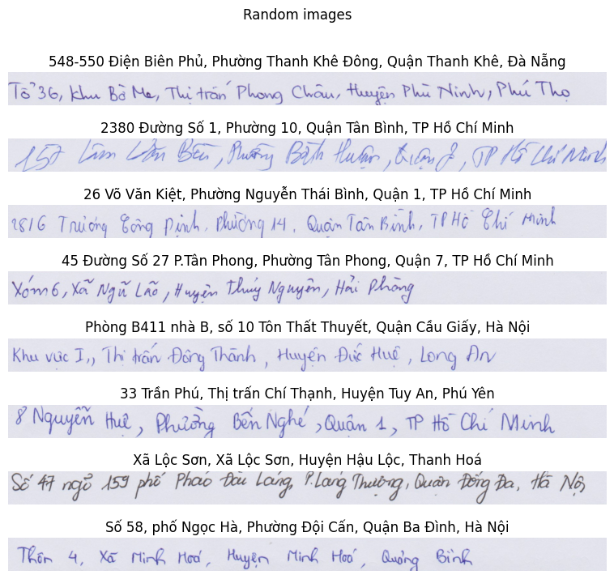

# CINNAMON AI MARATHON
# Giới thiệu
Cinnamon AI Marathon là một giải đấu kết hợp với lộ trình huấn luyện đầy thử thách hướng tới các "vận động viên" mang khát vọng chinh phục những bài toán thực tế trong lĩnh vực Trí Tuệ Nhân Tạo. Đặc biệt, Cinnamon AI Marathon 2018 MỞ RỘNG cho cả các tài năng nằm ngoài lãnh thổ Việt Nam.
Trong cuộc thi này gồm 3 challenges:
- [Handwriting OCR for Vietnamese Address](https://goo.gl/PHJCit)
- [Document Layout Analysis](https://goo.gl/wHi5DK)
- [Real Time Facial LandMark Detection](https://goo.gl/gcp77y)
Repo này chứa cách làm cho bài toán đầu tiên.

# Dataset
Dataset của BTC có thể tải tại [đây](https://www.kaggle.com/datasets/overvisual/vn-handwritten-images). Sau khi tải về, hãy đảm bảo tên dir sẽ là *vn_handwritten_images*

# Preprocess
Tiền xử lý của bài toán này dùng các hàm của [Albumentation](https://albumentations.ai/), chi tiết các bước như sau:
- Biến đổi góc nhìn ảnh
    - Xoay ảnh
    - Biến đổi Affine
- Biến đổi màu sắc ảnh
    - Thêm nhiễu Gauss
    - Chỉnh sửa độ tương phản, độ sáng của ảnh
    - Nén chất lượng ảnh 
# Model
Một trong những kiến trức cơ bản hay dùng cho bài toán OCR là CRNN + CTCLoss. CNN được dùng để extract features từ ảnh. sau đó các feature maps trở thành input đầu vào cho mạng RNN. mỗi feature map sẽ tương ứng với một timestep của mạng RNN. Sau đó dùng CTCLoss để tính loss tại một thời điểm và cập nhật lại trọng số cho cả mô hình.
Trong bài này điểm thú vị làm hàm CTCloss, hàm này giúp tính loss hiện tại của mô hình mà không thông tin về align của những kí tự trong ảnh. Lý thuyết về phân này có thể đọc thêm ở tài liệu được liệt kê ở mục [tham khảo](#references)
# Train
Vì dataset có số lượng ảnh hạn chế, nên mình quyết định tự tạo một model bao gồm mạng CNN dựa trên [vgg-19](https://paperswithcode.com/method/resnet) và mạng RNN dùng Bidirection GRU. 
Tập dataset được chia làm 2 tập train và validation. Nó được chia theo phương pháp stratify theo trường *bin10_target_length* tức là đếm số kí tự có trong nhãn và chia cho 10.
Các tham số trong lúc train mình dùng như sau:
- Optimizer Adam với learning_rate 1e-4
- batch_size là 8
- episodes: 130 (mô hình hội tụ khi dùng kèm EarlyStopping)
Chi tiết các bạn có thể tham khảo trong code của mình.

# Result
Đây là  biểu đồ loss tập validation của mình khi train trên [Kaggle kernel](https://www.kaggle.com/code/quntrnhongng/vnhandwritten-ocr). 

# References
- [Beam Search Decoding in CTC-trained Neural Networks](https://medium.com/towards-data-science/beam-search-decoding-in-ctc-trained-neural-networks-5a889a3d85a7)
- [Nhận Dạng Chữ Tiếng Việt - Vietnamese OCR](https://pbcquoc.github.io/vietnamese-ocr/)
- [Tìm hiểu bài toán OCR với CRNN và CTC loss - OCR from scratch with PyTorch (P1)](Tìm hiểu bài toán OCR với CRNN và CTC loss - OCR from scratch with PyTorch (P1))
- [Breaking down the CTC Loss](https://ogunlao.github.io/blog/2020/07/17/breaking-down-ctc-loss.html)
- [Sequence Modeling With CTC](https://distill.pub/2017/ctc/)
- [Giới thiệu về Connectionist Temporal Classification (CTC) (Phần 1)](https://viblo.asia/p/gioi-thieu-ve-connectionist-temporal-classification-ctc-phan-1-ORNZqj08l0n)

